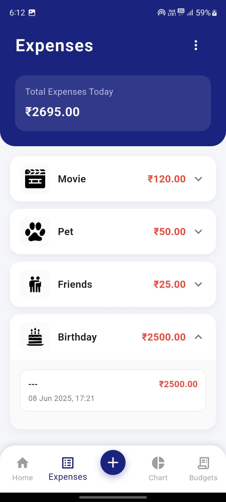
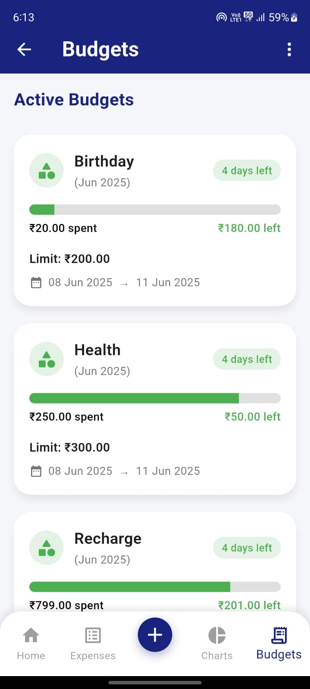
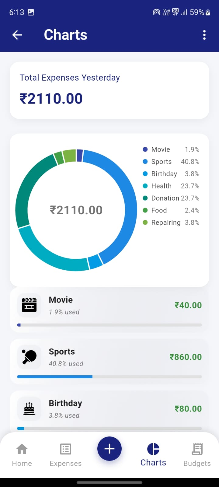
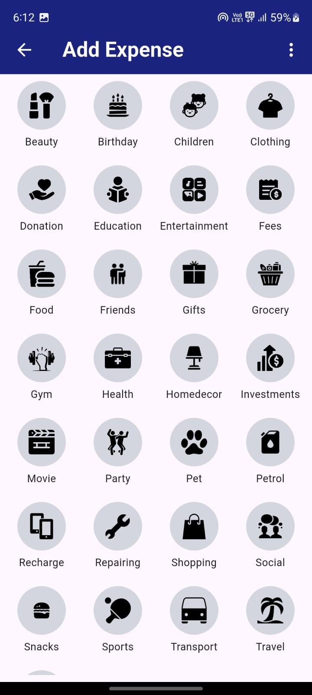

# 📱💰 SmartSpend - Personal Finance Management App

**SmartSpend** is a 📊 comprehensive personal finance management app built with **Flutter** and **Firebase**. It helps users track expenses, manage budgets, and gain valuable insights into their spending habits.

---

## 🌟 Features

### 🏠 Dashboard
- 📊 Overview of total expenses & income
- 📜 Quick access to recent transactions
- 📈 Visual representation of spending patterns
- 📅 Monthly & yearly financial summaries

### 💸 Expense Tracking
- ➕ Record daily expenses with categories
- 💰 Add income entries
- 🗂️ Categorize transactions
- 📝 Add notes & attachments
- 📜 View transaction history

### 🎯 Budget Management
- 📆 Set monthly budgets
- 📂 Create category-wise budgets
- 📊 Track budget utilization
- 🟢 View active & 🔴 past budgets
- 📈 Budget analysis & insights

### 📊 Analytics & Reports
- 📈 Visual charts & graphs
- 🗂️ Category-wise spending analysis
- 📊 Monthly & yearly comparisons
- 📄 Export reports
- 📉 Spending trends

### 👤 User Features
- 🔒 Secure authentication
- 📝 Profile management

---

## ⚙️ Tech Stack

- **🖥️ Frontend**: Flutter
- **🔥 Backend**: Firebase
- **🗄️ Database**: Cloud Firestore
- **🔐 Authentication**: Firebase Auth
- **📦 Storage**: Firebase Storage
- **📱 State Management**: Provider / Bloc

---

## 🚀 Getting Started

### 📋 Prerequisites
- ✅ Flutter SDK (latest)
- ✅ Dart SDK (latest)
- ✅ Firebase account
- ✅ Android Studio / VS Code
- ✅ Git

### 📥 Installation

1️⃣ Clone the repository:
```bash
git clone https://github.com/Ladanividhi/SmartSpend.git
```

2️⃣ Navigate to the project directory:
```bash
cd smartspend
```

3️⃣ Install dependencies:
```bash
flutter pub get
```
4️⃣ Configure Firebase:
   - Create a new Firebase project
   - Add Android and iOS apps to your Firebase project
   - Download and add the configuration files:
     - `google-services.json` for Android
     - `GoogleService-Info.plist` for iOS

5️⃣ Run the app:
```bash
flutter run
```

## 📌 Features in Detail

### 🎯 Budget Management
- 🔵 **Active Budgets**
- 🔴 **Past Budgets**
- 🗂️ **Category-wise budgets**
- 📊 **Budget analysis**

### 💸 Expense Tracking
- 📝 **Quick add expenses**
- 🗂️ **Categories**
- 📝 **Notes with transactions**
- 📖 **Complete history**

### 📈 Analytics
- 📊 **Charts**
- 📄 **Reports**
- 📉 **Trends**
- 🔍 **Comparisons**

---

## 🤝 Contributing

1️⃣ **Fork the repository**  
2️⃣ **Create a feature branch**
```bash
git checkout -b feature/AmazingFeature
```
3️⃣ **Commit your changes**
```bash
git commit -m 'Add some AmazingFeature'
```
4️⃣ **Push to the branch** 
```bash
git push origin feature/AmazingFeature
```
5️⃣ Open a Pull Request

## 📞 Contact

👩‍💻 **Vidhi Ladani**  
📧 **Email:** [23ceuog078@ddu.ac.in](mailto:23ceuog078@ddu.ac.in)  
🐙 **GitHub:** [Ladanividhi](https://github.com/Ladanividhi)  
🔗 **Project Link:** [SmartSpend Repository](https://github.com/Ladanividhi/SmartSpend)


## 📸 Screenshots

### 📊 Dashboard


### 👀 Expenses


### 💸 Budget Page


### 📊 Expense Chart


### 📈 Add Expenses



